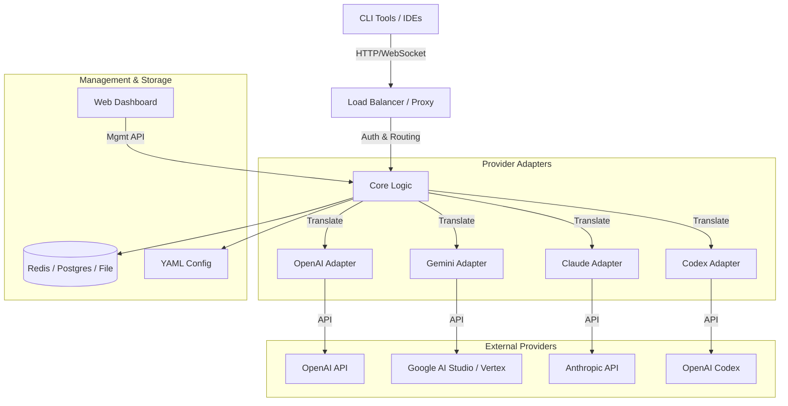

# CLI Proxy API

English | [中文](README_CN.md)

A powerful, unified proxy server that provides OpenAI, Gemini, Claude, and Codex compatible API interfaces for CLI tools and development environments. It simplifies managing multiple AI provider accounts, load balancing, and authentication through a single endpoint.


## 🌟 Key Features

*   **Unified API Interface**: Access OpenAI, Gemini, Claude, Codex, Qwen, and iFlow models through a single, standard API endpoint.
*   **Multi-Provider Support**: Seamlessly integrate with:
    *   **OpenAI** (GPT-3.5, GPT-4, Codex)
    *   **Google Gemini** (Pro, Flash, Ultra) & Vertex AI
    *   **Anthropic Claude** (Sonnet, Opus, Haiku) via OAuth or API Key
    *   **Alibaba Qwen**
    *   **iFlow**
*   **Smart Load Balancing**: Automatically distributes requests across multiple accounts and keys using round-robin or fill-first strategies.
*   **OAuth Management**: Built-in CLI authentication flows for providers that require OAuth (Gemini, Claude, Codex).
*   **Web Dashboard**: A modern, Next.js-based dashboard for real-time monitoring, configuration, and auditing.
*   **Usage Tracking**: Detailed metrics on token usage, request latency, and success rates.
*   **Amp CLI Integration**: Specialized support for [Amp CLI](https://ampcode.com) with model mapping and fallback routing.
*   **Go SDK**: Embeddable proxy functionality for your own Go applications.

## 🏗️ Architecture



## 🚀 Getting Started

### Installation

1.  **Clone the repository:**
    ```bash
    git clone https://github.com/router-for-me/CLIProxyAPI.git
    cd CLIProxyAPI
    ```

2.  **Build the server:**
    ```bash
    go build -o cli-proxy-api ./cmd/server
    ```

3.  **Run the server:**
    ```bash
    ./cli-proxy-api
    ```
    The server will start on `http://localhost:8317` by default.

### Configuration

The application uses a `config.yaml` file for configuration. A basic example:

```yaml
port: 8317
# Authentication directory for OAuth tokens
auth-dir: "~/.cli-proxy-api"

# API Keys for client authentication
api-keys:
  - "your-client-secret-key"

# Provider Configurations
gemini-api-key:
  - api-key: "AIzaSy..."
    models:
      - name: "gemini-1.5-flash"
        alias: "flash"

claude-api-key:
  - api-key: "sk-ant-..."
```

See `config.example.yaml` for a full list of options.

## 🖥️ Web Dashboard

Access the built-in dashboard at **`http://localhost:8317/dashboard`**.

Features:
*   **Live Metrics**: Watch real-time request throughput and latency.
*   **Provider Health**: Check the status of your connected accounts.
*   **Audit Logs**: View detailed logs of past requests (if enabled).
*   **API Playground**: Test your proxy configuration directly from the browser.
*   **Configuration**: Modify settings and API keys on the fly.

## 🔧 Management API

The server exposes a management API at `/v0/management` for programmatic control.
See [MANAGEMENT_API.md](MANAGEMENT_API.md) for full documentation.

## 📚 SDK Usage

You can use the core logic of this proxy in your own Go projects.
Check [docs/sdk-usage.md](docs/sdk-usage.md) for integration guides.

## 🤝 Contributing

Contributions are welcome! Please feel free to submit a Pull Request.

1.  Fork the repository
2.  Create your feature branch (`git checkout -b feature/amazing-feature`)
3.  Commit your changes (`git commit -m 'Add some amazing feature'`)
4.  Push to the branch (`git push origin feature/amazing-feature`)
5.  Open a Pull Request

## 📄 License

This project is licensed under the MIT License - see the [LICENSE](LICENSE) file for details.

## 🙏 Sponsors

Special thanks to our sponsors who support the development of this project:

[](https://z.ai/subscribe?ic=8JVLJQFSKB)

*   **Z.ai**: GLM CODING PLAN for AI coding.
*   **PackyCode**: Reliable API relay service.
*   **Cubence**: Efficient API relay provider.
