# CLI Proxy API 🚀

<div align="center">


**The Ultimate Unified AI Gateway for CLI Tools & Developers**

[](https://opensource.org/licenses/MIT)
[](https://goreportcard.com/report/github.com/router-for-me/CLIProxyAPI)
[](https://hub.docker.com/r/shinapi/shinapi)

[English](README.md) | [中文](README_CN.md)

</div>

---

**ShinAPI (CLI Proxy API)** is a high-performance, unified proxy server designed to bridge the gap between various AI providers and your favorite CLI tools. It provides a single, standardized endpoint compatible with **OpenAI**, **Gemini**, **Claude**, and **Codex** protocols, enabling seamless integration, smart load balancing, and centralized management.

Whether you're building AI agents, using coding assistants in your terminal, or developing custom LLM applications, ShinAPI simplifies your infrastructure.

## ✨ Key Features

### 🔌 Multi-Provider Integration
Unified access to the world's leading AI models through a single API surface:
-   **OpenAI**: Full support for GPT-3.5, GPT-4, and Codex models.
-   **Google Gemini**: Seamlessly use Gemini Pro, Flash, and Ultra via AI Studio or Vertex AI.
-   **Anthropic Claude**: Access the entire Claude 3 family (Opus, Sonnet, Haiku) with both API Key and OAuth support.
-   **DeepSeek & Qwen**: Integrated support for emerging powerhouses.
-   **iFlow**: Enterprise-grade model routing.

### ⚖️ Intelligent Load Balancing
Maximize reliability and throughput with built-in routing strategies:
-   **Round-Robin**: Distribute traffic evenly across multiple keys and accounts.
-   **Failover**: Automatically retry requests on backup providers if primary ones fail.
-   **Rate Limit Handling**: Smartly manage quotas to prevent downtime.

### 🔐 Advanced Authentication
-   **OAuth Flows**: Built-in CLI commands to easily authenticate with providers like Gemini, Claude, and Codex using OAuth 2.0.
-   **Centralized Auth**: Manage all your tokens in one secure location.

### 📊 Modern Web Dashboard
A comprehensive Next.js-based control panel included out-of-the-box:
-   **Real-time Analytics**: Monitor tokens/second (TPS), latency, and error rates live.
-   **Health Checks**: Instant visual status of all connected providers.
-   **Configuration Manager**: Update settings and rotate keys without restarting.
-   **API Playground**: Test prompts and debug responses directly in your browser.

### 🛠️ Developer Focused
-   **Amp CLI Support**: Native integration with [Amp CLI](https://ampcode.com) including model mapping (e.g., aliasing `claude-opus` to `gemini-pro`).
-   **Go SDK**: Import the core proxy logic directly into your Go applications.
-   **OpenAI Compatible**: Works with *any* tool that accepts an OpenAI-compatible `baseUrl`.

---

## 🏗️ Architecture

The proxy acts as a translation layer and intelligent router between your client tools and upstream AI providers.

```mermaid
graph LR
    subgraph Clients
        Terminal[CLI Tools]
        IDE[VS Code / Cursor]
        Agent[AI Agents]
    end

    subgraph "ShinAPI Gateway"
        LB[Load Balancer]
        Auth[Auth Manager]
        Router[Model Router]
        Translator[Protocol Translator]
    end

    subgraph Providers
        OpenAI[OpenAI API]
        Google[Google Vertex/Studio]
        Anthropic[Anthropic API]
        Custom[Custom/Local LLMs]
    end

    Clients -->|HTTP/WebSocket| LB
    LB --> Auth
    Auth --> Router
    Router --> Translator
    Translator --> Providers
```



---

## 🚀 Quick Start

### 1. Installation

**Using Go (Recommended):**
```bash
git clone https://github.com/router-for-me/CLIProxyAPI.git
cd CLIProxyAPI
go build -o cli-proxy-api ./cmd/server
```

**Using Docker:**
```bash
docker run -d -p 8317:8317 -v $(pwd)/config.yaml:/app/config.yaml shinapi/shinapi
```

### 2. Configuration

Create a `config.yaml` file:

```yaml
port: 8317
auth-dir: "~/.cli-proxy-api"

# Define your downstream API keys (for your clients)
api-keys:
  - "sk-my-secret-client-key"

# Configure Upstream Providers
gemini-api-key:
  - api-key: "AIzaSy..."
    models:
      - name: "gemini-1.5-flash"
        alias: "flash"

claude-api-key:
  - api-key: "sk-ant-..."
```

### 3. Run

```bash
./cli-proxy-api
```

Your proxy is now live at `http://localhost:8317`! 
Open `http://localhost:8317/dashboard` to view the dashboard.

---

## 📚 Documentation

*   **[SDK Usage Guide](docs/sdk-usage.md)**: Learn how to embed ShinAPI in your Go code.
*   **[Management API](MANAGEMENT_API.md)**: Automate configuration via HTTP endpoints.
*   **[Amp CLI Integration](https://help.router-for.me/agent-client/amp-cli.html)**: Setup guide for Amp users.

---

## 🤝 Contributing

We love contributions! Whether it's a bug fix, new feature, or documentation improvement:

1.  **Fork** the repository.
2.  Create a **Feature Branch** (`git checkout -b feature/cool-new-thing`).
3.  **Commit** your changes.
4.  **Push** to your branch.
5.  Open a **Pull Request**.

---

## 📄 License

ShinAPI is open-source software licensed under the [MIT License](LICENSE).

---

<div align="center">
  <sub>Built with ❤️ by the ShinAPI Team. Empowering developers to build the future of AI.</sub>
</div>
